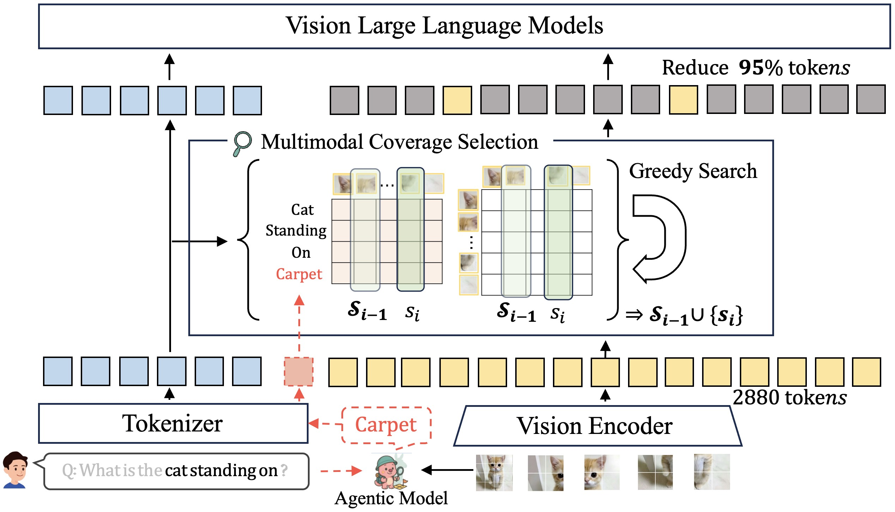
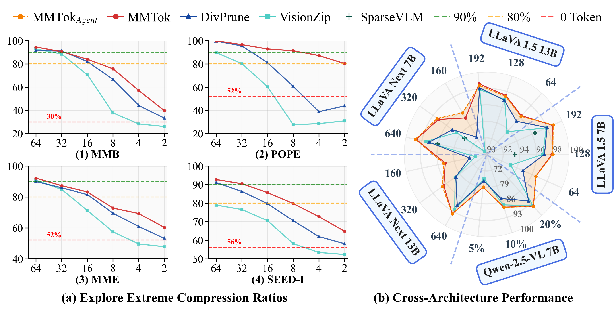

#  MMTok
Multimodal Coverage Maximization for Efficient Inference of VLMs


[](https://project.ironieser.cc/mmtok)
[](https://github.com/Ironieser/MMTok)
[](https://project.ironieser.cc/mmtok)

## 🚀 Overview

MMTok is a novel multimodal approach for efficient vision-language model (VLM) inference. By leveraging both vision and text tokens to select informative vision tokens through coverage maximization, our method achieves significant speedup while maintaining high performance.

## ✨ Key Features

- **1.87× Speedup** on H100 GPU (higher on other GPUs)
- **95%+ Performance Retained** at highest prune ratio on LLaVA-1.5 & Next (7B & 13B)
- **87.7% F1** with only **4 tokens** on POPE dataset
- **Multimodal Coverage Maximization** - leverages both vision and text information

## 🎯 Method

Our key insight is that **multimodal information is complementary for vision token selection**. We formulate the subset selection problem as a **coverage maximum problem**, where a subset of vision tokens is optimized to cover both text tokens and the original set of vision tokens simultaneously. This approach leverages both vision and text information to select the most informative vision tokens for efficient VLM inference.

## 📊 Results

| Model | Dataset | Speedup | Performance Retained |
|-------|---------|---------|---------------------|
| LLaVA-Next-13B | POPE | 1.87× | 98.7% |
| LLaVA-1.5-7B | POPE | - | 87.7% (4 tokens) |

## 🏗️ Architecture



Our multimodal framework combines vision and text information for efficient token selection.

## 📈 Performance Comparison



Comprehensive comparison with state-of-the-art methods across multiple models and datasets.

## 🚧 Coming Soon

- [ ] Paper on arXiv
- [ ] Code implementation
- [ ] Detailed blog post
- [ ] Chinese technical blog (知乎)

## 👥 Authors

- **Sixun Dong*** (Arizona State University)
- **Juhua Hu** (University of Washington)
- **Mian Zhang*** (UT Dallas)
- **Ming Yin*** (Duke University)
- **Yanjie Fu** (Arizona State University)
- **Qi Qian** (Zoom Communications) - Corresponding Author
  
*Work done during internship at Zoom.
## 📚 Citation

```bibtex
@article{dong2025mmtok,
  title={MMTok: Multimodal Coverage Maximization for Efficient Inference of VLMs},
  author={Dong, Sixun and Hu, Juhua and Zhang, Mian and Yin, Ming and Fu, Yanjie and Qian, Qi},
  journal={arXiv preprint},
  year={2025},
  note={Coming Soon}
}
```

## 🏠 Homepage

Visit our project homepage: **[project.ironieser.cc/mmtok](https://project.ironieser.cc/mmtok)**

## 🤝 Contributing

We welcome contributions! Please feel free to submit issues and pull requests.


## 🙏 Acknowledgments

We thank Zoom Video Communications for providing internship opportunities and research support. Special thanks go to our collaborators for their constructive feedback and support. In particular, Yebowen Hu offered valuable discussions and feedback, while Kaiqiang Song contributed many insightful discussions, extensive assistance with computational resource scheduling, and helpful exchanges that enriched our learning. We also acknowledge the support from Zoomies.

---

**MMTok: Efficient Vision Token Pruning for VLMs** 🎯
